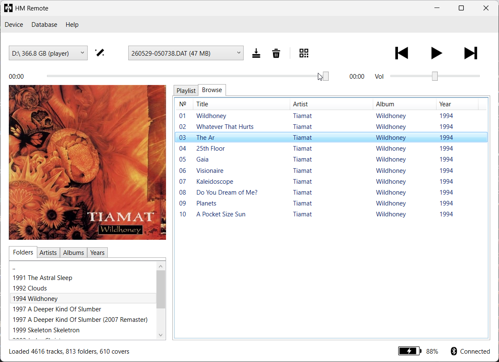
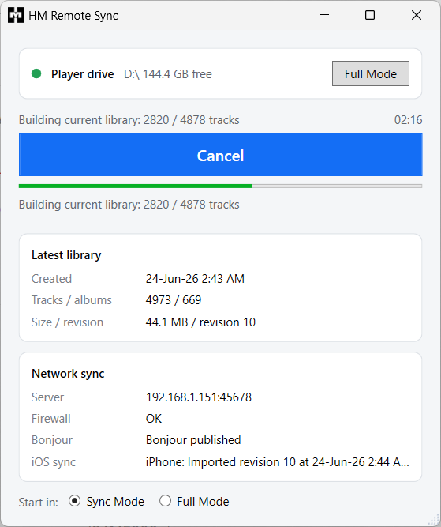

<p align="center">
  
</p>

<h1 align="center">HM Remote</h1>

<p align="center">
Desktop remote control, database management and library sync tool for <strong>HiFiMAN HM1000</strong> and <strong>HM901R</strong> players.
</p>

<p align="center">
  
</p>

<p align="center">
  
</p>

## Overview

HM Remote is a desktop application for remote control, music database management and library sync for __HiFiMAN HM1000__ and __HM901R__ players.

The project combines playback control, music library navigation, database management and local-network library sync in a single application. HM Remote allows you to control playback, browse your music collection, manage the playback queue, maintain player databases and prepare a compact library package for HM Remote for iOS without relying on the official HiFiMAN PC Assistant.

Version __1.0__ adds a new Sync Mode and a new `.library.hmremote` database format designed for my own iOS app, __HM Remote for iOS__.

## Remote Control

HM Remote provides a complete set of essential remote control functions:

* Play / Pause
* Previous / Next Track
* Volume Control
* Track Seek Bar
* Connect / Disconnect Player
* Remote Power Off
* Bluetooth LED On / Off

### Music Library

HM Remote allows you to browse the player's music library and start playback directly from the application:

* Browse music library by folders, artists, albums and years
* Start playback directly from the library
* Display current track information
* Display album artwork

### Playback Queue

* Add albums to the playback queue
* Replace the current queue with a selected album
* Remove tracks from the queue
* Reorder tracks within the queue
* View the current playback queue

### Player Status

* Battery level indication
* Charging status indication

## Database Management

HM Remote provides the complete functionality of the official HiFiMAN PC Assistant while extending it with additional features.

Supported features include:

* Create new databases
* Load existing databases
* Browse database contents
* Delete databases
* Generate QR codes for player import
* Reopen the last generated QR code with __Show Last QR__
* FAT32 and exFAT support
* Legacy HiFiMAN `.DAT` database generation
* New HM Remote `.library.hmremote` package generation

### Database Formats

HM Remote can generate:

* __HIFIMAN Database__ — the legacy `.DAT` format used by the player and QR import workflow
* __HM Database__ — the new `.library.hmremote` package format for HM Remote for iOS
* __Both__ — generate both database formats in one scan/build pass

The legacy `.DAT` workflow remains supported. The new HM Database format is an additional workflow, not a replacement.

### Incremental Database Updates

There is no need to rebuild an entire database every time your music collection changes.

HM Remote can update existing databases incrementally by analyzing changes and updating only affected entries. This significantly reduces processing time for large music libraries.

The application can work with memory cards installed in the player as well as cards connected directly through a card reader. Direct card access can dramatically reduce scanning and database generation times, especially when working with large collections.

Database scanning and generation can be cancelled at any time without waiting for the entire process to complete.

### Artwork Handling

HM Remote supports external album artwork.

During scanning, the application searches for artwork files in the album folder before falling back to embedded artwork, eliminating the need to embed the same image into every audio file.

Users can choose the size of generated artwork during database creation.

For the new `.library.hmremote` format, artwork is exported as JPEG and deduplicated, so identical covers are stored only once inside the package.

## Sync Mode

Version __1.0__ adds __Sync Mode__, a compact workflow for quickly generating and publishing the latest iOS library package.

The typical workflow is:

1. Connect the player or TF card to Windows.
2. Copy new music to the player.
3. Open HM Remote in Sync Mode.
4. Press __Sync__.

HM Remote then:

* Detects the connected player drive
* Scans the music library
* Reads metadata
* Extracts artwork
* Generates the latest `.library.hmremote` package
* Publishes it as `library.hmremote`
* Advertises the sync service on the local network via Bonjour
* Serves the package over HTTP
* Waits for HM Remote for iOS to confirm that the revision was imported

This makes daily library updates very fast: copy music, press __Sync__, and the iPhone imports the latest library.

Sync Mode uses one stable package file:

```text
library.hmremote
```

The file is replaced on each sync, so old Sync Mode packages do not accumulate.

## HM Remote Library Format

The new `.library.hmremote` format is a ZIP package containing:

* `manifest.json`
* `library.json`
* `covers/*.jpg`

The format is more compact and flexible than the legacy DAT/QR workflow. It stores library metadata, albums, tracks, folders and artwork in a structure designed for HM Remote for iOS.

The package includes metadata such as:

* Library revision
* Track count
* Album count
* TF card size
* Total scanned music size

The library JSON stores clean numeric references such as `CoverId` instead of temporary file paths or export-specific filenames.

## HM Remote for iOS

__HM Remote for iOS__ is my own iOS app built for the new `.library.hmremote` format and Sync Mode workflow.

The iOS app can discover HM Remote for Windows on the local network, download the latest package, import it and report the imported revision back to Windows.

HM Remote for iOS is not publicly released at the moment. I use it privately.

## A Modern Replacement for PC Assistant

HM Remote provides the complete functionality of the official HiFiMAN PC Assistant while adding full-featured desktop remote control and a modern library sync workflow.

The project was designed as a single application for HM1000 and HM901R owners, combining playback control, music library navigation, database management and local-network library sync.

## Requirements

* Windows 10/11 x64
* Microsoft .NET 8 Desktop Runtime (x64)

## Download

The latest version is available on the Releases page.

## Support the Project

HM Remote is a free non-commercial project developed in spare time.

If you find the software useful and would like to support further development, donations are welcome.

The iOS app mentioned above is currently private, but it represents the direction of the project: a modern replacement for HiFiMAN's outdated mobile software ecosystem, with faster library handling and a cleaner sync workflow.

With sufficient community interest and support, a public iOS release or an __Android__ version may follow.

### PayPal

https://paypal.me/finvarg

### Bitcoin (BTC)

bc1qy2fvxxvdmepyy0rhq642g36elx206u9f8fcff9

### USDT, USDC, ETH (ERC-20)

0x4eD9462a071d51C54BdaF63de5a1d7DACd4A6245
